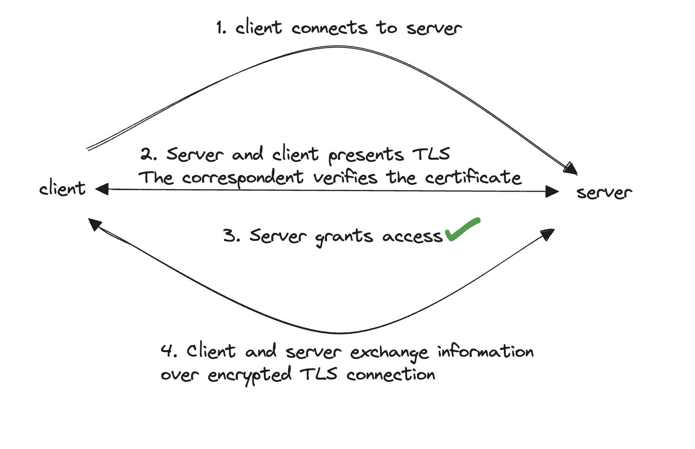

# mTLS

mTLS is such for mutal authentication. mTLS ensures that parties at each end of a network connection are certified by verifying that they both have the correct private key.

mTLS can be used to protext against a variet of attacks including malicious API requests, credential stuffing, phishing attacks. brute force attacks and more.

**How is mTLS different from what has been described in this lecture**

In the lecture, certificates are presented from the server to the client. This is to verify that you own the corresponding DNS. This means authenticity only happens in one direction. Whereas, mTLS extends the security of TLS by adding mutal authentication of between BOTH the client and the server. As a result of this, both client and server present their certicates to each other and verify the identity of each other before establishing a secure connection. This means mTLS makes authenticity symmetric.

In addition to this, an organisation implementing mTLS acts as its own certificate authority whereas TLS certicate authority is an external organisation which would send a request to your DNS in which you would have to respond with a particular value to verify you are the owner.

Because of this symmetric authnetication, it is more complex to implement; it can be difficult anf costly for the server to maintain certificates for all the clients, to valide and verify each client for each session.

**where is mTLS frequently used and give an example application which uses mTLS**

mTLS is often used in a Zero Trust seurity framework to verify users, devices, and serves within an organisation E.g. THG! It can also help keep APIs secure.

There a variet of applictions of mTLS.
Companies uses mTLS to identify and authorise connecting devices to a corporate network.
Other applications are to connect to cloud serves, API secruity, HTTP web service secruity.

**draw a diagram to show the process**

